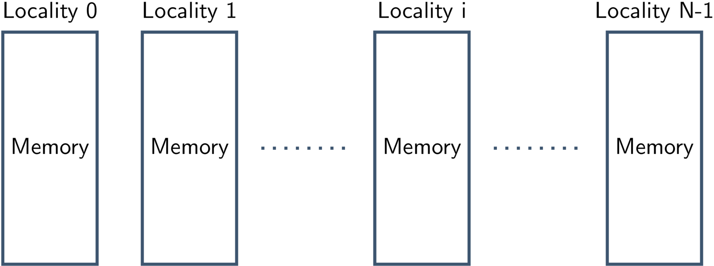
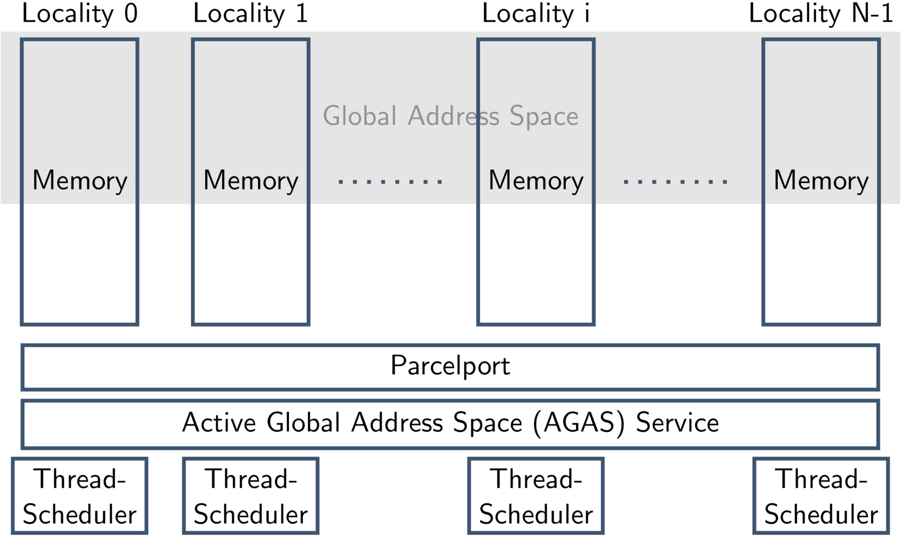
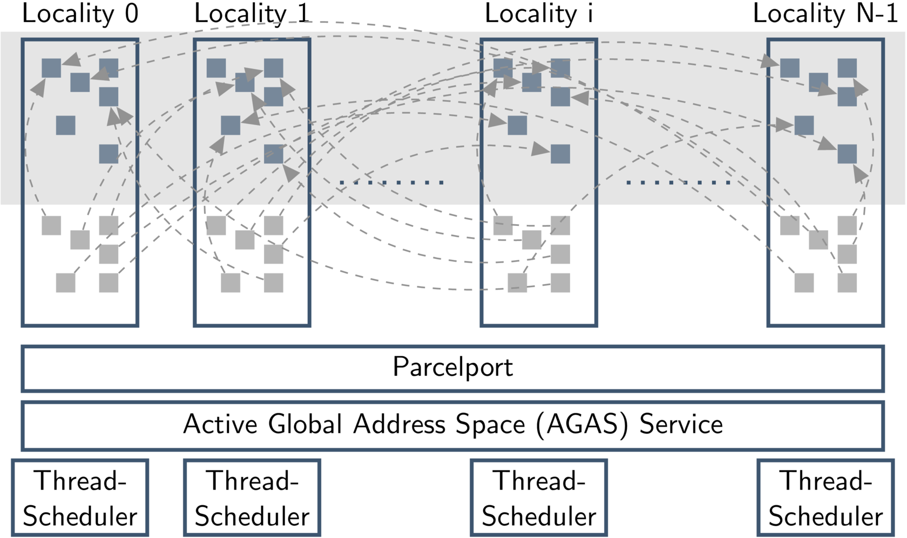
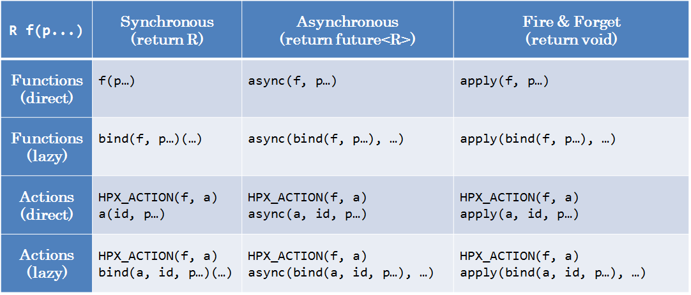
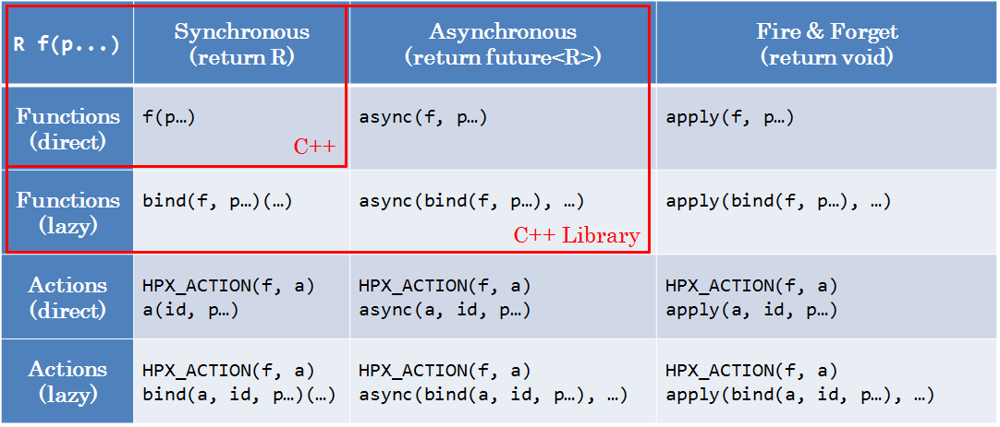

class: center, middle

# Introduction to HPX
##  
## An asynchronous C++ parallel programming framework

### 18.10.2019

Thomas Heller (thomas.heller@exasol.com)

---

# What is HPX?

* A C++ Standard Library for Concurrency and Parallelism

* Solidly based on a theoretical foundation – a well defined, new execution model
* Exposes a coherent and uniform, standards-oriented API for ease of
  programming parallel and distributed applications.
    * Enables to write fully asynchronous, blocking free code
    * Provides unified syntax and semantics for local and remote operations.
* Developed to run at any scale
* Compliant C++ Standard implementation (and more)
* Open Source: Published under the Boost Software License

---

# What is HPX?

HPX represents an innovative mixture of

* A global system-wide address space (AGAS - Active Global Address Space)
* Fine grain parallelism and lightweight synchronization
* Combined with implicit, work queue based, message driven computation
* Full semantic equivalence of local and remote execution, and
* Explicit support for hardware accelerators

---
## The HPX Programming Model



---
## The HPX Programming Model



---
## The HPX Programming Model


---
## The HPX Programming Model


---
## The HPX Programming Model



---
## HPX - A C++ Standard Library


---
## HPX - A C++ Standard Library


---
## The HPX API
### Strictly conforming to the C++ Standard

Class                           | Description
--------------------------------|-----------------------------------
`hpx::thread`                   | Low level thread of control
`hpx::mutex`                    | Low level synchronization facility
`hpx::lcos::local::condition_variable`      | Signal a condition
`hpx::future`                   | Asynchronous result transport (receiving end)
`hpx::promise`, `hpx::lcos::local::promise` | Asynchronous result transport (producing end)
`hpx::lcos::packaged_task`      | Asynchronous result transport (producing end)
`hpx::async`                    | Spawning tasks (returns a future)
`hpx::bind`                     | Binding Parameters to callables
`hpx::function`                 | Type erased function object
`hpx::tuple`                    | Tuple
`hpx::any`                      | Type erased object (similar to `void*`)
`hpx::parallel::for_each`, etc. | Parallel Algorithms
`hpx::compute::vector`          | Continous storage for N elements, also GPU

Extensions to the standards APIs where necessary, maintaining full compatibility.

---
## The HPX API
### Lightweight Control Objects (LCOs)

 * Objects to synchronize between different threads of execution.
 * Ability to suspend and reactivate tasks
 * Examples:
    * `mutex`
    * `condition_variable`
    * `channel`
    * `promise`
    * `packaged_task`
    * `future`
    * `when_all`, `when_any`, `wait_all`, `wait_any`
    * ...

---
## The HPX API



---
## The HPX API


---
## The HPX API



---
## The HPX API


---
## What is a (the) future?

A future is an object representing a result which has not been calculated yet

.left-column[

]

.right-column[
* Enables transparent synchronization with producer
* Hides notion of dealing with threads
* Makes asynchrony manageable
* Allows for composition of several asynchronous operations
* Turns concurrency into parallelism
]

---
## What is a (the) future?

Many ways to get hold of a future, simplest way is to use (std) async:

```
int universal_answer()
{
    return 42;
}
```
--
```
void deep_thought()
{
    future<int> promised_answer = async(&universal_answer);

    // do other things for 7.5 million years

    cout << promised_answer.get() << endl;   // prints 42
}
```

---
## Producing Futures
### `hpx::async`

```
template <typename F, typename... Ts>
auto async(F&& f, Ts&&... ts)
 -> future<decltype(f(std::forward<Ts>(ts)...)>;
```

* `F` is anything callable with the passed arguments (actions are callable)

--

```
template <typename F, typename... Ts>
auto async(launch_policy, F&& f, Ts&&... ts)
 -> future<decltype(f(std::forward<Ts>(ts)...)>;
```

* `launch_policy` can be `async`, `sync`, `fork`, `deferred`

--

```
template <typename Executor typename F, typename... Ts>
auto async(Executor&&, F&& f, Ts&&...  ts)
 -> future<decltpype(f(std::forward<Ts>(ts)...)>;
```

* `Executor` is a concept providing means to control where and how the task
should be executed

---
## Producing Futures
### `hpx::lcos::local::promise`

```
hpx::lcos::local::promise<int> p;       // local only
hpx::future<int> f = p.get_future();
// f.is_ready() == false, f.get(); would lead to a deadlock

p.set_value(42);

// Print 42
std::cout << f.get() << std::endl;
```

---
## Producing Futures
### `hpx::promise`

```
hpx::promise<int> p;                    // globally visible
hpx::future<int> f = p.get_future();
// f.is_ready() == false, f.get(); would lead to a deadlock

hpx::async(
    [](hpx::id_type promise_id)
    {
        hpx::set_lco_value(promise_id, 42);
    }
  , p.get_id());

// Print 42
std::cout << f.get() << std::endl;

```

---
## Producing Futures
### `hpx::make_ready_future`

* Producing futures that are ready at construction

```
template <typename T>
future<typename decay<T>::type> make_ready_future(T&& t);

future<void> make_ready_future();
```

---
## Producing Futures
### And beyond ...

* Futures are the main interface to express asynchrony
* Most API functions in HPX return futures


---
## Composing Futures
### Sequential Composition: `future::then`

```
future<int> f1 = hpx::async(...);

// Call continuation once f1 is ready. f2 will become ready once
// the continuation has been run.
future<double> f2 = f1.then(
    [](future<int>&& f) { return f.get() + 0.0; });
```

--

* The continuation needs to take the future as parameter to allow
  for exception handling. Exceptions happening in asynchronous calls
  will get rethrown on `.get()`
* `then` accepts launch policies as well as executors
* `f1` will get invalidated.

--

No invalidation:

```
shared_future<int> f1 = hpx::async(...);

// Call continuation once f1 is ready. f2 will become ready once
// the continuation has been run.
future<double> f2 = f1.then(
    [](future<int>&& f) { return f.get() + 0.0; });
```

---
## Composing Futures
### And Composition: `when_all`

```
future<int> f1 = hpx::async(...);
future<std::string> f2 = hpx::async(...);

auto all_f = hpx::when_all(f1, f2);

future<std::vector<float>> result =
    all_f.then(
        [](auto f) -> std::vector<float>
        {
            // ...
        });
```

--
* Allows for attaching continuations to more than one future
* `f1` and `f2` will get invalidated. (Use `shared_future` if you need them afterwards)
* Also accepts a `std::vector<future<T>>` or a pair of iterators

---
## Composing Futures
### Or Composition: `when_any`

```
std::vector<future<int>> fs = ...;

future<int> fi =
    hpx::when_any(fs).then(
        [](auto f)
        {
            auto res = f.get();
            return res.futures[res.index];
        });
```

* Allows for waiting on *any* of the input futures
* Returns a `future<when_any_result<Sequence>>`:

--

```
template <typename Sequence>
struct when_any_result
{
   std::size_t index; // Index to a future that became ready
   Sequence futures;  // Sequence of futures
};
```


---
## Composing Futures
### Dataflow

* Shortcut to `when_all(...).then(...)`

```
future<int> f1 = hpx::async(...);
future<std::string> f2 = hpx::async(...);

future<double> f3 =
    hpx::dataflow(
        [](future<int>, future<std::string>) -> double
        {
            // ...
        },
        std::move(f1), std::move(f2));

```


---

## What is HPX not (currently)?

* Easy to use in existing projects

* Lightweight (in terms of integration)

* Fully modular

---

## Roadblocks for adoption

* `hpx::init`

* "All or nothing" mentality

---

## Main contributions of HPX

* `hpx::future`, `hpx::dataflow`, `hpx::when_all`

* *LOTS* of high quality C++ utilities

* Distributed computing with modern C++ (serialization, low overhead RPCs)

--

    &rArr; Decouple The HPX asynchronous programming model from the runtime
--

    &rArr; Create Building blocks for heterogeneous execution of tasks (Executors)

---
class: center, middle

## Basic Definitions
### &nbsp;
### Customizing the HPX programming model

Based on [P0443](https://wg21.link/p0443)

---

## Execution Resource

* "Places" in a system that might execute tasks, or where tasksa need to run in
  proximity

    * CPU Cores

    * GPUs

    * Memory Hierarchies

    * Remote nodes

---

## Execution Context

* An `Execution Context` uses one or more `Execution Resource`

* Specifies how tasks are being created (`Execution Agent`)

* Examples:

    * OpenMP

    * `std::thread`

    * `hpx::thread`

    * Stackless tasks

    * GPU offloading

    * Remote offloading

---

## Execution Agent

* An `Execution Agent` is created by the `Execution Context`

* Runs on the specified `Execution Resource`

* Executes the task

* May be suspend, resume or yield the thread of execution

---

## Adapting HPX Concepts

* Using Execution Contexts as the main API to spawn tasks

    &rArr; Provides customization points for other runtimes

    &rArr; `hpx::async` (and friends) now potentially work in any environment

* Using Execution Agents to build synchronization primitives

    &rArr; Basic building blocks using agents to yield/suspend/resume execution

    &rArr; `hpx::future` (and friends) now potentially work in any environment

---

## Using `hpx::future` with OpenMP

```
namespace hpx { namespace openmp {
    struct context : hpx::basic_execution::default_context
    {
        void post(hpx::util::unique_function_nonser<void()> f) const override;

        auto executor() const;
    };

    struct agent : hpx::basic_execution::default_agent
    {
        agent(context const& ctx) : hpx::basic_execution::default_agent(ctx)
        {}

        hpx::openmp::context const& context() const override
        {
            return context_;
        }
    };

    void context::post(hpx::util::unique_function_nonser<void()> f) const
    {
#pragma omp task firstprivate(f)
        {
            f();
        }
    }
}}
```
---

## Using `hpx::future` with OpenMP

```
int main()
{
    hpx::future<int> f;
#pragma omp parallel
    {
        hpx::openmp::context ctx;

#pragma omp single
        f = hpx::async(ctx.executor(), []()
        {
            std::cout << "Hello" << " World\n";
            return 42;
        });
    }

    std::cout << "Result: " << f.get();
}
```

---

## Using `hpx::future` with MPI

```
struct mpi_future_data : hpx::lcos::detail::task_base<void>
{
    HPX_NON_COPYABLE(mpi_future_data);

    using init_no_addref = hpx::lcos::detail::task_base<void>::init_no_addref;

    mpi_future_data() = default;

    mpi_future_data(init_no_addref no_addref)
      : hpx::lcos::detail::task_base<void>(no_addref)
    {}

    void do_run()
    {
        boost::intrusive_ptr<mpi_future_data> this_(this);
        // FIXME: Do a proper progress thread
        std::thread progress([this_]()
        {
            MPI_Status status;
            MPI_Wait(&this_->request, &status);
            this_->set_data(hpx::util::unused);
        });
        progress.detach();
    }

    MPI_Request request;
};
```

---

## Using `hpx::future` with MPI

```
template <typename F, typename ...Ts>
hpx::future<void> invoke(F f, Ts &&...ts)
{
    boost::intrusive_ptr<mpi_future_data> data =
        new mpi_future_data(mpi_future_data::init_no_addref{});
    f(std::forward<Ts>(ts)..., &data->request);

    using traits::future_access;
    return future_access<hpx::future<void>>::create(std::move(data));
}
```

---

## Using `hpx::future` with MPI

```
int rank = 0; int size = 0; int result = 0;

MPI_Comm_rank(MPI_COMM_WORLD, &rank);
MPI_Comm_size(MPI_COMM_WORLD, &size);

int dst_rank = rank == size - 1 ? 0 : rank + 1;
int src_rank = rank == 0 ? size - 1 : rank - 1;

if (rank == 0) {
    MPI_Send(&result, 1, MPI_INT, dst_rank, 0, MPI_COMM_WORLD);
}

auto f = hpx::mpi::invoke(
    MPI_Irecv, &result, 1, MPI_INT, src_rank, 0, MPI_COMM_WORLD);

f.then([&](auto f) mutable {
    f.get(); // propagate exceptions...
    if (rank == 0) {
        std::cout << "Result: " << result << "\n";
        return hpx::make_ready_future();
    }

    result += rank;

    return hpx::mpi::invoke(
        MPI_Isend, &result, 1, MPI_INT, dst_rank, 0, MPI_COMM_WORLD);
}).get();
```


---

## HPX modularization

* Splitting HPX into self contained smaller libraries

* Make the different parts usable independently

.left-column[
* algorithms
* assertion
* cache
* collectives
* config
* coroutines
* datastructures
* errors
* execution
* format
]
.right-column[
* functional
* iterator_support
* logging
* plugin
* preprocessor
* program_options
* serialization
* testing
* timing
* topology
]

* Mainly driven by Mikael Simberg and Auriane Reverdell at CSCS

---

## Conclusion

* HPX provides a framework for parallel and concurrent programming

  * Abstractions for spawning tasks remotely and locally are readily available

  * Makes asynchronity/parallelism/concurrency managable

  * High performance and high quality implementation

* Road to adaption possible in single steps

---

class: center, middle

## Questions?
