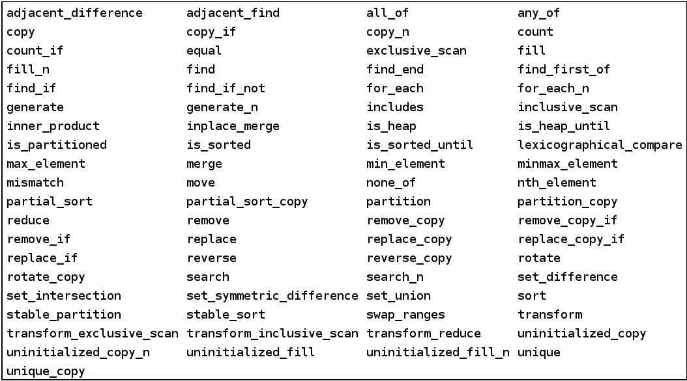

class: center, middle

# Massive Parallelism in C++

### Munich C++ User Group Meeting - 25.01.2018

Thomas Heller (thom.heller@gmail.com)

---

class: center, middle

## Why Parallelism?
### The free lunch is over

---

## Why Parallelism?
### It's everywhere!

.center.middletext.bold.large[Everywhere?]

---

## Why Parallelism?
### Architectural Processor Improvements

 * Single core performance hard to improve

    * Scaling the frequency unfeasible
    * Increasing complexity not viable

&rArr; Instead of making a single core faster, just add more cores

---

## Why Parallelism?
### It's everywhere!

 * Embedded Devices

--

    * Intelligent Sensors/Actors
    * Internet of Things
    * Smartphones
    * Gaming Devices

--

 * Personal Computer

--

    * Work Station
    * Laptop
    * Desktop

--

 * Server systems

--

 * Accelerators (GPUs, DSPs, ...)

---

## Why Parallelism?
### Distributed Computing

 * Cloud

    - Size hard to tell
    - Google: about 2.5 million servers in total
    - Elastic Scalabilty

 * Supercomputers

    - Tightly couple applications
    - TOP500:
        - 1: Sunway TaihuLight, 10,469,600 cores
        - 2: Tianhe-2, 3,120,000 cores
        - 3: Piz Daint, 361,760 cores
        - 4: Gyoukou, 19,860,000 cores
        - 5: Titan, 560,640 cores
        - average number of cores: 138,009.28


---

## Parallelism vs. Concurrency

.left-column[
 * Waiter preparing a meal and drink
 * Tasks:
    - Accept order
    - Prepare drink
    - Prepare meal
    - Serve
]

---

## Parallelism vs. Concurrency

.left-column[
 * Waiter preparing a meal and drink
 * Tasks:
    - Accept order
    - Prepare drink
    - Prepare meal
    - Serve
]
.right-column[
  * Sequential Execution:
  
]

---

## Parallelism vs. Concurrency

.left-column[
 * Waiter preparing a meal and drink
 * Tasks:
    - Accept order
    - Prepare drink
    - Prepare meal
    - Serve
]
.right-column[
  * Concurrent Execution
  
]

---

## Parallelism vs. Concurrency

.left-column[
 * Waiter preparing a meal and drink
 * Tasks:
    - Accept order
    - Prepare drink
    - Prepare meal
    - Serve
]
.right-column[
  * Parallel Execution
  
]

---

## In other words ...
.left-column[
  * Sequential Execution:
  
]
.right-column[
  * Concurrent/Parallel Execution
  
]

---

class: center, middle

## Defining an API...
### Towards better Concurrency and Parallelism

--

#### What C++ provides

--

#### How can it be improved

--

#### And more

---

## Parallelism
### And the C++ Standard

 * C++ gained support for parallelism with C++11

    * Memory Model
    * `#include <atomic>`
    * `#include <mutex>`
    * `#include <condition_variable>`
    * `#include <thread>`
    * `#include <future>`

 * New in C++17: Parallel Algorithms!

---
## `#include <atomic>`
### Support for atomic operations

 * Defines types and functions for atomic memory accesses
 * Includes Memory ordering:

    * A happens before B
    * Avoids reordering of instructions

---
## `#include <thread>`
### Support for spawning threads

 * Thread of Execution:

       "A thread of execution is a sequence of instructions that can be executed concurrently with other such sequences in multi-threading environments, while sharing a same address space."

       &rArr; `std::thread`

 * Synchronization primitives (`<mutex>` and `<condition_variable>`):

  * `std::mutex`
  * `std::condition_variable`/`std::condition_variable_any`
  * `std::lock_guard`
  * `std::unique_lock`

---

## `#include <thread>`
### Let's implement our restaurant!

```
// Sequential implementation
void restaurant()
{
    while(auto order = accept_order())
    {
        auto drink = prepare_drink(order);
        auto meal = prepare_meal(order);
        serve(order, drink, meal);
    }
}
```

--

```
// Using threads...
std::vector<std::thread> threads;
for(std::size_t i = 0; i < std::thread::hardware_concurrency(); ++i)
{
    threads.emplace_back(&restaurant);
}
for(auto& t: threads) t.join();
```

---

## `#include <thread>`
### Let's try again...

```
while(auto order = accept_order())
{
    std::thread t([order = std::move(order)](){
        auto drink = prepare_drink(order);
        auto meal = prepare_meal(order);
        serve(order, drink, meal);
    });
    t.detach();
}
```

--

How could we do better?

--

 * Decompose different tasks
 * Implement it concurrently

---

## Problems with `std::thread`

 * No means to return result
 * Can not be composed easily
 * Very low level

---

## `#include <future>`
### Back to the future...

 * Asynchronous Result helper
 * Differentiation between Producer and Consumer
 * Communication via reference counted shared state
 * Transports either a value or exception

```
using namespace std;
template <typename T>
struct shared_state
{
    union {
        T value;
        exception_ptr exception;
    } data;
    mutex mutex;
    condition_variable cv;
    enum state { empty, value, exception };
    state s;
};
```

---

## `#include <future>`
### Back to the future...

.left-column[
Producer:
```
template <typename T>
void set_value(T&& t)
{
    {
        unique_lock<mutex> l(mtx);
        data.value = forward<T>(t);
        s = value;
    }
    cv.notify_all();
}
```
]
.right-column[
Consumer
```
T get_value()
{
    unique_lock<mutex> l(mtx);
    while (s == empty)
        cv.wait(l);

    if (s == exception)
      rethrow_exception(data.exception);
    return data.value;
}
```
]

---

## `#include <future>`
### Back to the future...

 * Producers:
    * `std::promise<R>`
    * `std::async`
    * `std::packaged_task<R(Args...)>`

 * Consumers:
    * `std::future<R>`
    * `std::shared_future<R>`

---

## `#include <future>`
### Problems with the future

 * Value/Exception can be retrieved by:

    * Blocking (`future<R>::get`)
    * Polling (`future<R>::is_ready`)

--

 * Concurrency TS to the rescue:

    * Ability to attach continuations

```
void restaurant()
{
    while(auto order = accept_order())
    {
        auto drink = async(&prepare_drink, order);
        auto meal = async(&prepare_meal, order);
        auto ready = when_all(drink, meal).then([order](auto f) {
            auto [drink, meal] = f.get();
            serve(order, drink.get(), meal.get());
        });
    }
}
```

---

## `#include <future>`
### Problems with the future

 * Callback hell?
 * Coroutine TS to the rescue:

    * Compiler generated continuations

```
future<void> restaurant()
{
    while(auto order = accept_order())
    {
        auto drink = async(&prepare_drink, order);
        auto meal = async(&prepare_meal, order);

        serve(order, co_await drink, co_await meal);
    }
}
```

---

## Pitfalls
### Overheads, oh my

 * The presented code will probably never scale
    * `std::thread`/`std::async` create Operating System Threads

      &rArr; Massive Overhead

    * More parallelism, more overhead

      &rArr; Working Set needs to be large enough

--

  * Solutions

    * Thread-pool of function objects?

--
      Can you guarantee forward progress?

---


## Overheads
### Modeling with the USL

<iframe src="https://www.desmos.com/calculator/svtwiefz7k" width="90%" height="80%" style="border: 1px solid #ccc" frameborder=0></iframe>

---

.left-column[
<blockquote class="twitter-tweet" data-lang="en"><p lang="en" dir="ltr">Dear HPX: How? <a href="https://t.co/12u1n8bBdi">pic.twitter.com/12u1n8bBdi</a></p>&mdash; Billy O&#39;Neal (@MalwareMinigun) <a href="https://twitter.com/MalwareMinigun/status/880299153493970945?ref_src=twsrc%5Etfw">June 29, 2017</a></blockquote>
<script async src="https://platform.twitter.com/widgets.js" charset="utf-8"></script>
]
.right-column[

]

---

## HPX as a possible solution
### What is HPX?

* A C++ Standard Library for Concurrency and Parallelism

* Solidly based on a theoretical foundation – a well defined, new execution model
* Exposes a coherent and uniform, standards-oriented API for ease of
  programming parallel and distributed applications.
    * Enables to write fully asynchronous code using hundreds of millions of threads.
    * Provides unified syntax and semantics for local and remote operations.
* Developed to run at any scale
* Compliant C++ Standard implementation (and more)
* Open Source: Published under the Boost Software License

---

## HPX as a possible solution
### Represents an innovative mixture of

* A global system-wide address space (AGAS - Active Global Address Space)
* Fine grain parallelism and lightweight synchronization
* Combined with implicit, work queue based, message driven computation
* Full semantic equivalence of local and remote execution, and
* Explicit support for hardware accelerators

---
### Recap: What's HPX

* Widely portable
    * Platforms: x86/64, Xeon/Phi, ARM 32/64, Power, BlueGene/Q
    * Operating systems: Linux, Windows, Android, OS/X
* Well integrated with compiler’s C++ Standard libraries
* Enables writing applications which out-perform and out-scale existing
  applications based on OpenMP/MPI

  http://stellar-group.org/libraries/hpx

  http://github.com/STEllAR-GROUP/hpx

* Is published under Boost license and has an open, active, and thriving
  developer community.
* Can be used as a platform for research and experimentation

---
## The HPX Programming Model


---
## The HPX Programming Model


---
## The HPX Programming Model


---
## The HPX Programming Model


---
## The HPX Programming Model


---
## HPX - A C++ Standard Library


---
## HPX - A C++ Standard Library


---

## Executors
### Concept

* Executors are objects responsible for
    * Creating execution agents on which work is performed (N4466)
    * In N4466 this is limited to parallel algorithms, here much broader use
* Abstraction of the (potentially platform-specific) mechanisms for launching work
* Responsible for defining the **Where** and **How** of the execution of tasks

---
## Executors
### Implementation

* Executors must implement one function:
```
    async_execute(F&& f, Args&&... args)
```
* Invocation of executors happens through `executor_traits` which exposes (emulates) additional functionality:

```
    executor_traits<my_executor_type>::async_execute(
        my_executor,
        [](size_t i){ // perform task i }, n);
```

* Four modes of invocation: single async, single sync, bulk async and bulk sync
* The async calls return a future

---
## Executors
### Examples

* `sequenced_executor`, `parallel_executor`:
    * Default executors corresponding to par, seq
* `this_thread_executor`
* `thread_pool_executor`
    * Specify core(s) to run on (NUMA aware)
* `distribution_policy_executor`
    * Use one of HPX’s (distributed) distribution policies, specify node(s) to run on
* `hpx::compute::host::block_executor`
    * Use a set of CPUs
* `hpx::compute::cuda::default_executor`
    * Use for running things on GPU
* Etc.

---
## Execution Parameters

* Allow to control the grain size of work
    * i.e. amount of iterations of a parallel `for_each` run on the same thread
    * Similar to OpenMP scheduling policies: `static`, `guided`, `dynamic`
    * Much more fine control

---
## Rebind Execution Policies

Execution policies have associated default executor and default executor
parameters

* `par`: parallel executor, static chunk size
* `seq`: sequenced executor, no chunking
    * Rebind executor and executor parameters

```
// rebind only executor
numa_executor exec;
auto policy1 = par.on(exec);
```
--
```
// rebind only executor parameter
static_chunk_size param;
auto policy2 = par.with(param);
```
--
```
// rebind both
auto policy3 = par.on(exec).with(param);
```

---
## Data Placement
### Basics

* Mechanism to tell **where** to allocate data
* C++ defines an Allocator concept `std::allocator<T>`
* Extensions:
    * Where do you want to allocate Data
    * Ability to bulk allocate Data (NUMA aware allocation, GPU Device Allocation)
* Data Structures to use those allocators
* Different strategies for different platforms
    * Need interface to control explicit placement of data
         * NUMA architectures
         * GPUs
         * Distributed systems

---
## Data Placement
### Data Structures

* `hpx::compute::vector<T, Allocator>`
    * Same interface as `std::vector<T>`
    * Manages data locality through allocator
    * Uses execution target objects for data placement
    * Allows for direct manipulation of data on NUMA domains, GPUs, remote nodes, etc.
* `hpx::partitioned_vector<T>`
    * Same interface as `std::vector<T>` (almost)
    * Segmented data store
    * Segments can be `hpx::compute::vector<T>`
    * Uses distribution_policy for data placement
    * Allows for manipulation of data on several targets

---
## Execution Targets

* Opaque type which represent a place in the system
    * Used to identify data placement
    * Used to specify execution site close to data
* Targets encapsulate architecture specifics
    * CPU sets (NUMA domains), Scratch Pad Memory, GPU devices, Remote nodes
* Allocators to be initialized from targets
    * Customization of data placement
* Executors to be initialized from targets as well
    * Make sure code is executed close to placed data

---
## Parallel Algorithms



---
## Example: SAXPY - The HPX Way

**Goal**: SAXPY routine with data locality

* `a[i] = b[i] * x + c[i]` for `i` from `0` to `N-1`
* Using parallel algorithms
* Explicit control over data locality
* No raw loops

---
## Example: SAXPY - The HPX Way

**Step 1**: Writing the serial version

.left-column[
```
std::vector<double> a = ...;
std::vector<double> b = ...;
std::vector<double> c = ...;
double x = ...;

std::transform(
    b.begin(), b.end(), c.begin(),
    a.begin(),
    [x](double bb, double cc)
    {
*       return bb * x + cc;
    }
);
```
]

.right-column[
* `bb` is `b[i]`
* `cc` is `c[i]`
* the calculated value gets written to `a[i]`
* [Complete code](https://github.com/STEllAR-GROUP/tutorials/tree/master/examples/04_saxpy/serial.cpp)
]

---
## Example: SAXPY - The HPX Way

**Step 2**: Parallelize it

.left-column[
```
std::vector<double> a = ...;
std::vector<double> b = ...;
std::vector<double> c = ...;
double x = ...;

*hpx::parallel::transform(
*   hpx::parallel::execution::par,
    b.begin(), b.end(), c.begin(),
    a.begin(),
    [x](double bb, double cc)
    {
        return bb * x + cc;
    }
);
```
]

.right-column[
* Replace the standard algorithm with a parallel one
* Set parallel exeuction policy
* [Complete code](https://github.com/STEllAR-GROUP/tutorials/tree/master/examples/04_saxpy/parallel.cpp)
]

---
## Example: SAXPY - The HPX Way

**Step 3**: Adding data locality

.left-column[
```
using hpx::compute::host;

typedef block_executor<> executor;
typedef block_allocator<double>
    allocator;

auto numa_domains = numa_nodes();
executor exec(numa_domains);
allocator alloc(numa_domains);

using hpx::compute::vector;

vector<double, allocator> a = ...;
vector<double, allocator> b = ...;
vector<double, allocator> c = ...;
double x = ...;
```
]

.right-column[
```
*using hpx::parallel::execution::par;
*auto policy = par.on(exec);
hpx::parallel::transform(policy,
    b.begin(), b.end(), c.begin(),
    a.begin(),
    [x](double bb, double cc)
    {
        return bb * x + cc;
    }
);
```
* Get targets for locality of data and execution
* Setup Executor and Allocator
* Run on the allocator
* [Complete code](https://github.com/STEllAR-GROUP/tutorials/tree/master/examples/04_saxpy/parallel_numa.cpp)
]

---
## Example: SAXPY - The HPX Way

**Optional Step**: Running it on the GPU

.left-column[
```
using hpx::compute::cuda;

typedef default_executor<> executor;
typedef allocator<double> allocator;

target device("K40");
executor exec(device);
allocator alloc(device);

using hpx::compute::vector;

vector<double, allocator> a = ...;
vector<double, allocator> b = ...;
vector<double, allocator> c = ...;
double x = ...;
```
]
.right-column[
```
*using hpx::parallel::execution::par;
*auto policy = par.on(exec);
hpx::parallel::transform(policy,
    b.begin(), b.end(), c.begin(),
    a.begin(),
    [x](double bb, double cc)
    {
        return bb * x + cc;
    }
);
```
* Get targets for locality of data and execution
* Setup Executor and Allocator
* Run on the allocator
* [Complete code](https://github.com/STEllAR-GROUP/tutorials/tree/master/examples/04_saxpy/parallel_cuda.cu)
* Works only for CUDA version 8 :(
]

---

## Conclusion

 * Task based programming unifies concurrency and parallelism
 * The C++ Standard provides a good specification
 * High Performance implementations are possible
 * Extensible

 * Lot's of work left to do

---

class: center, middle

# Questions?
