class: center, middle

# Massiver Parallelismus mit C++

### Parallel 2019 - 21.02.2019

Thomas Heller (thom.heller@gmail.com)

Slides: [https://sithhell.github.io/talks/parallel_19_21_02/](.)

Code: [https://github.com/sithhell/talks/blob/master/parallel_19_21_02/code](.)

<!--
Agenda:
1) Task Parallelism in C++ (Introduction to std::future/std::async)
2) Drawbacks of the approach (coarse grained tasks, aka OS threads, and overheads)
3) How to enable massive parallelism
   3.1) Making tasks efficient (transition to fine-grained threads) and finer grained
   3.2) Making task scheduling scalable
4) Conclusion and Outlook: Embedding into HPX and new possibilities by leveraging fine grain tasks
  4.1) Millions of Tasks without millions of cores, scaling from embedded to many-core
  4.2) Making std::future efficient
-->

---

class: center, middle

## Why Parallelism?
### The free lunch is over

---

## Why Parallelism?
### It's everywhere!

.center.middletext.bold.large[Everywhere?]

---

## Why Parallelism?
### Architectural Processor Improvements

 * Single core performance hard to improve

    * Scaling the frequency unfeasible
    * Increasing complexity not viable

&rArr; Instead of making a single core faster, just add more cores

---

## Why Parallelism?
### It's everywhere!

.center.middletext.bold.large[Everywhere!]

---

## In other words ...
.left-column[
  * Sequential Execution:
  
]
.right-column[
  * Concurrent/Parallel Execution
  
]

---

## Task Parallelism in C++
### The future of threads

 * C++ gained support for parallelism with C++11

    * Memory Model
    * `#include <atomic>`
    * `#include <mutex>`
    * `#include <condition_variable>`
    * `#include <thread>`
    * `#include <future>`

 * New in C++17: Parallel Algorithms!

---
## `#include <atomic>`
### Support for atomic operations

 * Defines types and functions for atomic memory accesses
 * Includes Memory ordering:

    * A happens before B
    * Avoids reordering of instructions

---
## `#include <thread>`
### Support for spawning threads

 * Thread of Execution:

       "A thread of execution is a sequence of instructions that can be executed concurrently with other such sequences in multi-threading environments, while sharing a same address space."

       &rArr; `std::thread`

 * Synchronization primitives (`<mutex>` and `<condition_variable>`):

  * `std::mutex`
  * `std::condition_variable`/`std::condition_variable_any`
  * `std::lock_guard`
  * `std::unique_lock`

---
## `#include <thread>`
### Drawbacks

 * No means to return result
 * Can not be composed easily
 * Very low level
 * Error-prone
---

## `#include <future>`
### Back to the future...

 * Asynchronous Result helper
 * Differentiation between Producer and Consumer
 * Communication via reference counted shared state
 * Transports either a value or exception

```
using namespace std;
template <typename T>
struct shared_state
{
    union {
        T value;
        exception_ptr exception;
    } data;
    mutex mutex;
    condition_variable cv;
    enum state { empty, value, exception };
    state s;
};
```

---

## `#include <future>`
### Back to the future...

.left-column[
Producer:
```
template <typename T>
void set_value(T&& t)
{
    {
        unique_lock<mutex> l(mtx);
        data.value = forward<T>(t);
        s = value;
    }
    cv.notify_all();
}
```
]
.right-column[
Consumer
```
T get_value()
{
    unique_lock<mutex> l(mtx);
    while (s == empty)
        cv.wait(l);

    if (s == exception)
      rethrow_exception(data.exception);
    return data.value;
}
```
]

---

## `#include <future>`
### Back to the future...

 * Producers:
    * `std::promise<R>`
    * `std::async`
    * `std::packaged_task<R(Args...)>`

 * Consumers:
    * `std::future<R>`
    * `std::shared_future<R>`

---

## `#include <future>`
### Problems with the future

 * Value/Exception can be retrieved by:

    * Blocking (`future<R>::get`)
    * Polling (`future<R>::is_ready`)

 * Still not composable

---

## Pitfalls
### Overheads, oh my

* `std::thread`/`std::async` create Operating System Threads

  &rArr; Massive Overhead

* More parallelism, more overhead

  &rArr; Working Set needs to be large enough

--

  * Solutions

    * Thread-pool of function objects?

---

.left-column[
<blockquote class="twitter-tweet" data-lang="en"><p lang="en" dir="ltr">Dear HPX: How? <a href="https://t.co/12u1n8bBdi">pic.twitter.com/12u1n8bBdi</a></p>&mdash; Billy O&#39;Neal (@MalwareMinigun) <a href="https://twitter.com/MalwareMinigun/status/880299153493970945?ref_src=twsrc%5Etfw">June 29, 2017</a></blockquote>
<script async src="https://platform.twitter.com/widgets.js" charset="utf-8"></script>
]
.right-column[

]

---

## Pitfalls
### Dealing with Hardware Complexity

 * Example (provided by [packet.com](https://packet.com)):

    * 2x Intel Xeon 6128 (Skylake-EP)
--
    * 12 Cores per Chip (2xSMT)
--
    * 2x NVIDIA V100 GPUS
--
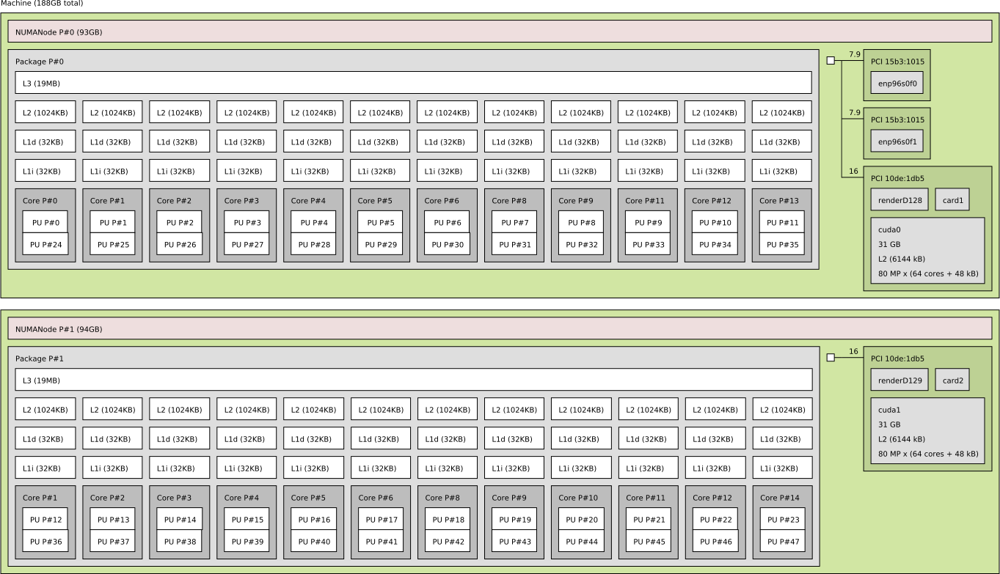

---
## Pitfalls
### Dealing with Hardware Complexity


---
## Pitfalls
### Dealing with Hardware Complexity

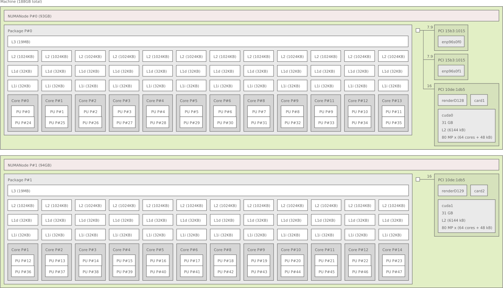
.left-column[
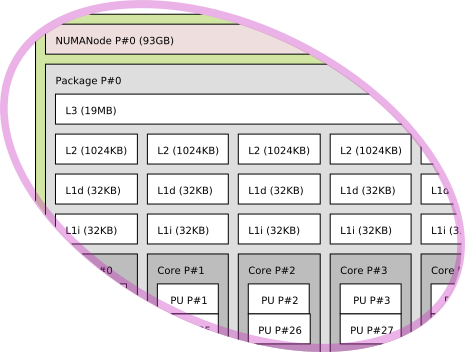
]
.right-column[
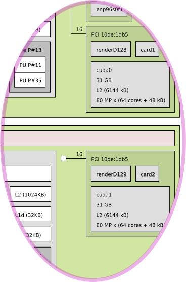
]

---
## Pitfalls
### Dealing with Hardware Complexity

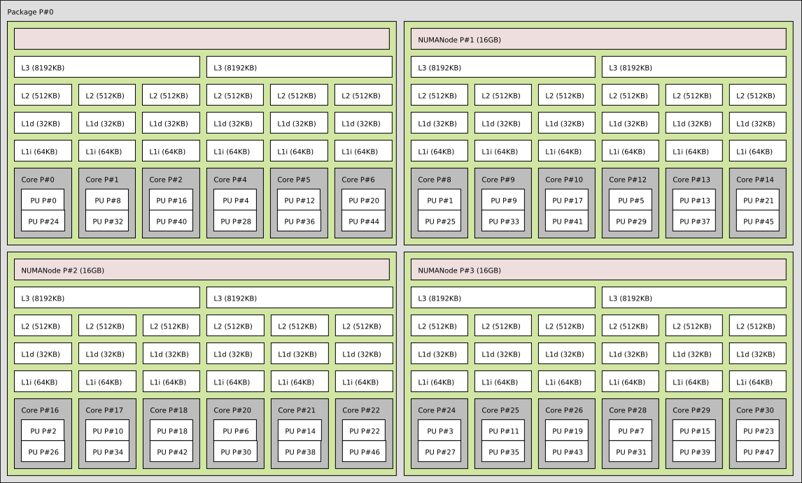

---

## Execution Placement
### Basics

* Executors:

    * Objects responsible for creating execution agents on which work is performed
    * Abstraction of the (potentially platform-specific) mechanisms for launching work
    * Responsible for defining the **Where** and **How** of the execution of tasks

---
## Data Placement
### Basics

* Mechanism to tell **where** to allocate data

* C++ defines an Allocator concept `std::allocator<T>`

* Extensions:

    * Where do you want to allocate Data
    * Ability to bulk allocate Data (NUMA aware allocation, GPU Device Allocation)

* Data Structures to use those allocators

* Different strategies for different platforms

    * Need interface to control explicit placement of data

         * NUMA architectures
         * GPUs
         * Distributed systems

---
## Tying it all together
### Execution Resources

* Expose Topology of System

    * Memory Topology
    * Processing Element Topology

* Represented as a tree

* Derive Execution Contexts

* Derive Memory Allocators

* [Demo Code](https://github.com/sithhell/talks/blob/master/parallel_19_21_02/code/execution_resource.cpp)

---
## Tying it all together
### Create Executors from Resources

* An Executor is Execution Context

* Create Executors from a set of Execution Resources

* Abilty to partition your parallelism

* Create Hierarchies representing the topology

    &rArr; High-Level abstraction to exploit Low-Level hardware details

* [Demo Code](https://github.com/sithhell/talks/blob/master/parallel_19_21_02/code/executor.cpp)

---
## Tying it all together
### Create Allocators from Resources

* Query Memory Resource from Execution Resource

* Use Memory Resource inside an Allocator

* Abilty to co-locate code and data

    &rArr; High-Level abstraction to exploit Low-Level hardware details

* [Demo](https://github.com/sithhell/talks/blob/master/parallel_19_21_02/code/saxpy.cpp) [Code](https://github.com/sithhell/talks/blob/master/parallel_19_21_02/code/saxpy_numa.cpp)

---
## Reducing Overheads
### A threadpool of function objects

* Ability to create and execute different tasks

* Use queues to store pending tasks

* Scalable to millions of parallel tasks

--

* Drawback:

    * What if a task needs to block?
    * Executes in the context of the Underlying OS Thread
    * No forward progress guarantee

---
## Reducing Overheads
### A threadpool of User-Level Threads (Fibers)

* Instead of plain function objects:

    * Execution Context with own stack

    * Ability to yield control

* Almost full compatibility with syntax and semantic to `std::thread`

* Including synchronization primitives

* Forward progress guarantee*

* [Demo Code](https://github.com/sithhell/talks/blob/master/parallel_19_21_02/code/tasks.cpp)

--

* Drawback:

    * More expensive

---
## Reducing Overheads

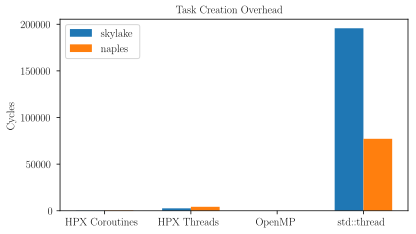

---
## Reducing Overheads

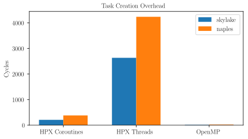

---
## Reducing Overheads

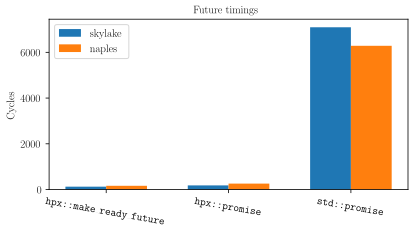

---
## Reducing Overheads

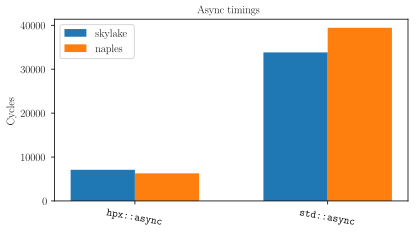

---
## Reducing Overheads

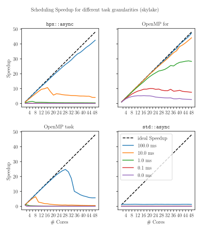

---
## Reducing Overheads
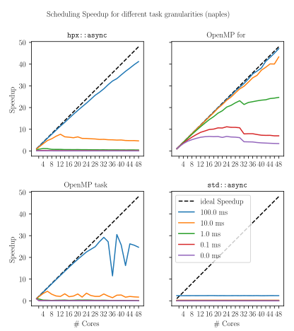

---

## The future on fibers
### Unleashing the power

* Implement future on top of fiber primitives & execution resources

* Implement support to attach continuations

* Combine ability of creating myriads of tasks with task continuations

    &rArr; Powerful execution graphs with fine grain tasks and dataflow execution

* [Demo Code](https://github.com/sithhell/talks/blob/master/parallel_19_21_02/code/future.cpp)

---
## The HPX Runtime System
### Full implementation of the presented concepts

* A C++ Standard Library for Concurrency and Parallelism

* Solidly based on a theoretical foundation – a well defined, new execution model

* Exposes a coherent and uniform, standards-oriented API for ease of
  programming parallel and distributed applications.

    * Enables to write fully asynchronous code using hundreds of millions of threads.
    * Provides unified syntax and semantics for local and remote operations.

* Developed to run at any scale

* Compliant C++ Standard implementation (and more)

* Open Source: Published under the Boost Software License

  * http://stellar-group.org/libraries/hpx
  * http://github.com/STEllAR-GROUP/hpx

---

class: center, middle

# Questions?
